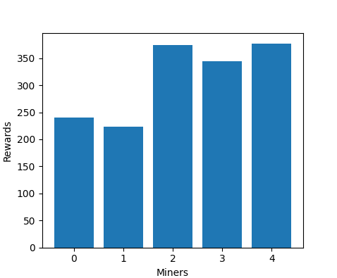

# Setup
Clone the repo and install the required packages:
```
git clone https://github.com/oneskovic/cocp_simulations.git
cd cocp_simulations
pip install -r requirements.txt
```
## Usage example
```py
import numpy as np
import matplotlib.pyplot as plt
from simulate_strategy import MiningSimulator

miner_cnt = 5
simulator = MiningSimulator(
    problem_cnt=100,
    packet_size=5,
    miner_compute_powers=np.full(miner_cnt, 10.0),
    miner_thresholds_low=np.full(miner_cnt, 0.0),
    miner_thresholds_high=np.full(miner_cnt, 2.0),
    iterations=50
)
search_times, mine_times, rewards = simulator.run_simulation()
plt.bar(range(miner_cnt), rewards)
plt.xlabel('Miners')
plt.ylabel('Rewards')
plt.show()
```

# Description of simulator
The simulator is a simple environment that simulates strategies of miners on the network as proposed in the proof of useful work paper. 
## Assumptions
The simulator is based on the following assumptions:
1. Each miner follows this strategy:
    - Decide which package treshold is acceptable
    - Look for a package that fits the treshold
    - Start mining the package
    - Once someone finds a new block, stop mining, do not change tresholds, find a new package and repeat this process.
2. Each miner has perfect knowledge of the problem difficulties (essentially difficulty estimation is perfect)
3. Problem fee is a function of the difficulty and difficulty only
4. Each miner finds packets with rate proportional to the miner's compute power
## Simulation
### Parameters
The parameters of the main `MiningSimulator` class are:
- `problem_cnt`: The number of problems in the instance pool.
- `packet_size`: The number of problems in a packet.
- `miner_compute_powers`: A numpy array of size (number of miners) that contains the compute power of each miner (in difficulty/s).
- `miner_thresholds_low`: Left bound of the threshold interval for each miner. A numpy array of size (number of miners).
- `miner_thresholds_high`: Right bound of the threshold interval for each miner. A numpy array of size (number of miners).
- `iterations`: Number of iterations to run the simulation for.
- `packet_creator`: Packet creator class (check `PacketCreatorSimulated` in `packet_creation.py` for the interface). Defaults to `PacketCreatorSimulated`.
- `difficulty_generator`: The function that generates the difficulties of the problems in the instance pool. Defaults to `get_difficulties_pareto`.
### Initialization
- Run difficulty generator and store in `self.problem_difficulties`. These are the difficulties of problems currently in the "instance pool".
- Compute remaining times (how much time each miner will need for each problem). This is a numpy array of shape (number of miners, number of problems). Store in `remaining_times`.

### Simulation loop
The simulator performs the following steps the given number of times:
- For each miner find the packet that fits the threshold. Compute the time needed to find the packet.
- For each miner compute the time spent to mine the packet (the time that miner would need to create a block).
- Find the winner (miner that has the lowest time spent searching + time spent mining).
- Reward the winner as per the `get_fee` function.
- Reset the difficulties of problems that were mined by the winner. Update `self.problem_difficulties`.
- Update the remaining times for all miners - although the other miners did not mine a block, they still solved some problems, or made progress. Update `remaining_times`.
- For each miner update the remaining times for the new problems that were generated instead of the mined problems. Update `remaining_times`.
